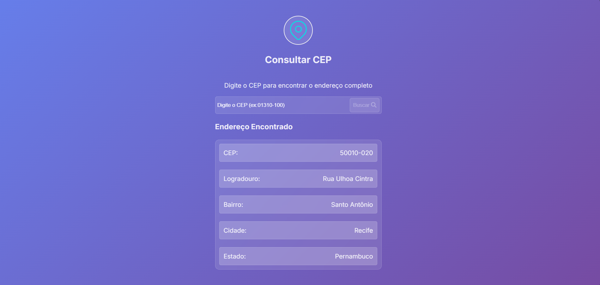

#  ViaCep React

Uma aplicação web moderna e responsiva para consulta de CEPs brasileiros, desenvolvida com React e Vite, utilizando a API gratuita do ViaCEP.

>  **Observação sobre a API**: Esta aplicação utiliza a API pública e gratuita do ViaCEP. Como a API não exige chave ou credenciais, a URL e as chamadas à API podem aparecer diretamente no código-fonte. Evite adicionar qualquer credencial sensível neste repositório.

##  Tecnologias Utilizadas

- **React 19** - Biblioteca JavaScript para construção de interfaces
- **Vite** - Build tool rápida e moderna
- **Axios** - Cliente HTTP para requisições à API
- **CSS3** - Estilização com design responsivo
- **ViaCEP API** - API gratuita para consulta de CEPs

##  Funcionalidades

-  **Consulta de CEP**: Digite um CEP e obtenha informações completas do endereço
-  **Validação de entrada**: Verificação automática se o CEP possui 8 dígitos
-  **Tratamento de erros**: Mensagens claras para CEPs inválidos ou não encontrados
-  **Design responsivo**: Interface adaptável para diferentes dispositivos
-  **Performance otimizada**: Carregamento rápido com Vite

##  Informações Retornadas

A aplicação exibe as seguintes informações do endereço:

- CEP
- Logradouro (rua, avenida, etc.)
- Bairro
- Cidade
- Estado

## 🛠️ Instalação e Configuração

### Pré-requisitos

- Node.js (versão 16 ou superior)
- npm ou yarn

### Passo a passo

1. **Clone o repositório**

   ```bash
 https://github.com/ElissonAmaro/ViaCep.git
   ```

2. **Instale as dependências**

   ```bash
   npm install
   ```

3. **Execute o projeto em modo de desenvolvimento**

   ```bash
   npm run dev
   ```

4. **Acesse a aplicação**

   Abra seu navegador e vá para `http://localhost:5173`

##  Scripts Disponíveis

- `npm run dev` - Executa a aplicação em modo de desenvolvimento
- `npm run build` - Gera a versão otimizada para produção
- `npm run preview` - Visualiza a versão de produção localmente
- `npm run lint` - Executa o linter para verificar o código

##  Como Usar

1. Digite um CEP válido no campo de entrada (formato: 12345-678 ou 12345678)
2. As informações do endereço serão exibidas abaixo
3. Em caso de erro, uma mensagem informativa será mostrada

### Exemplos de CEPs para teste:

- `01310100` (São Paulo - SP)
- `20040020` (Rio de Janeiro - RJ)
- `30112000` (Belo Horizonte - MG)

##  Estrutura do Projeto

```
src/
├── assets/                  # Arquivos estáticos (imagens, fontes, etc.)
├── components/
│   └── Card.jsx             # Componente para exibir dados do CEP
├── services/
│   └── api.jsx              # Configuração do Axios e chamadas à API
├── App.jsx                  # Componente principal
├── index.css                # Estilos globais
└── main.jsx                 # Ponto de entrada da aplicação
```


##  Links Úteis

- [API ViaCEP](https://viacep.com.br/) - Documentação da API utilizada
- [React](https://react.dev/) - Documentação oficial do React
- [Vite](https://vitejs.dev/) - Documentação do Vite

## Autor: Elisson

##  Capturas de Tela

### Tela Inicial


### Resultado da Busca


